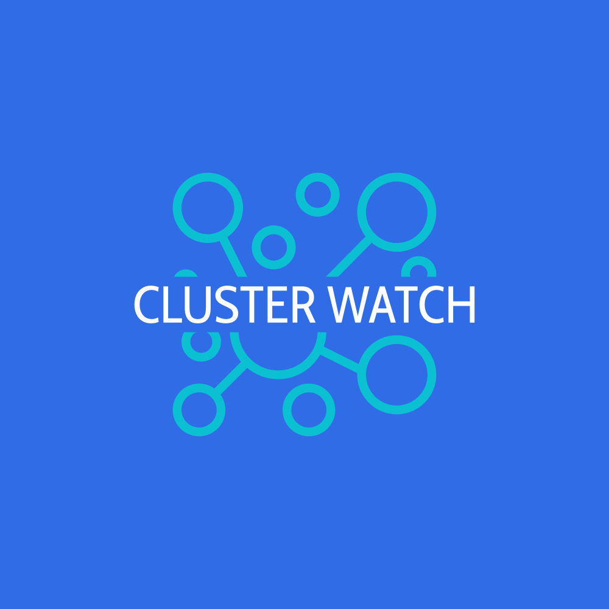
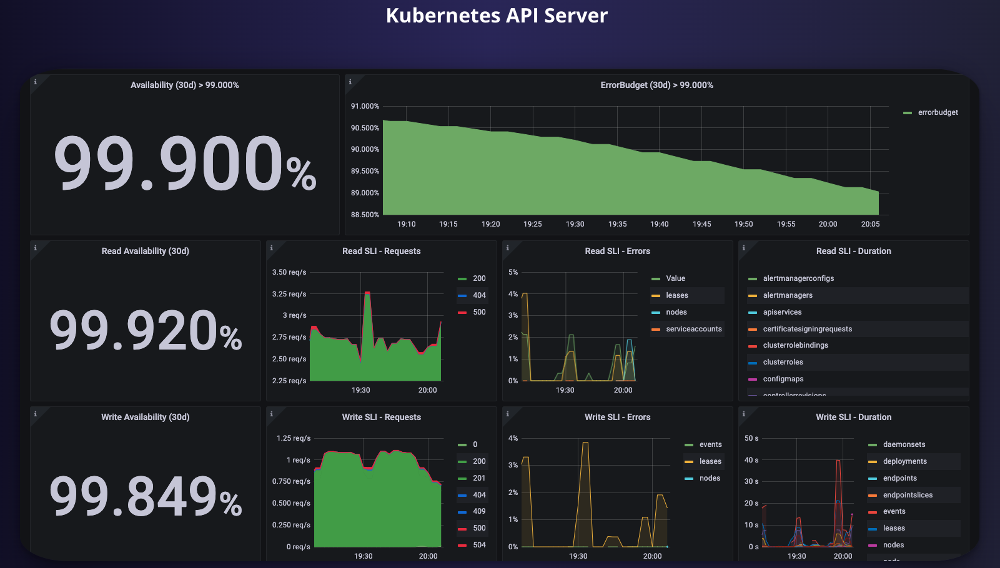
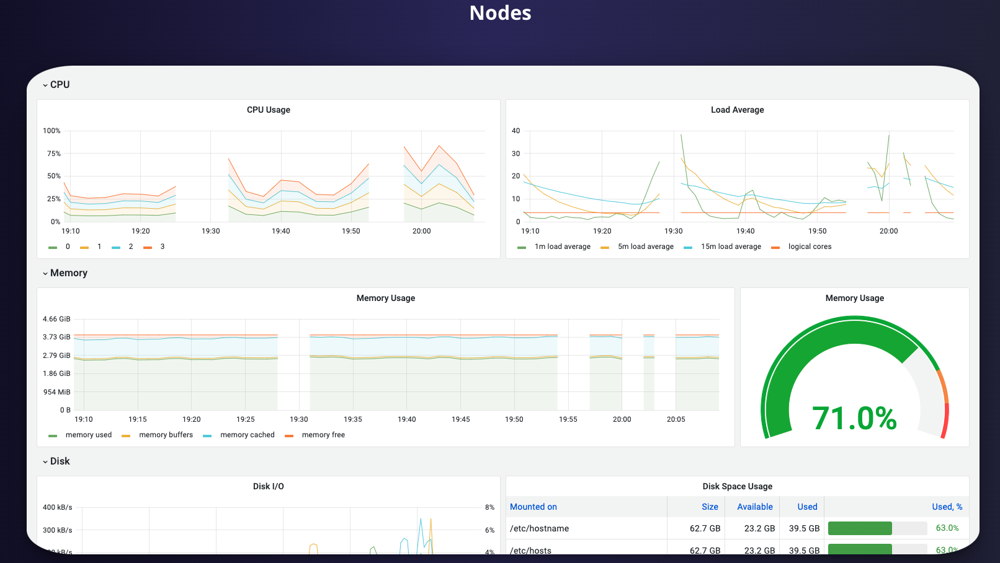
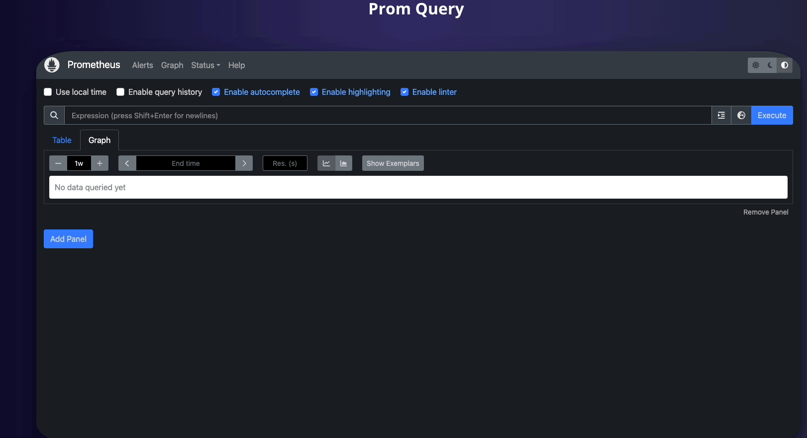
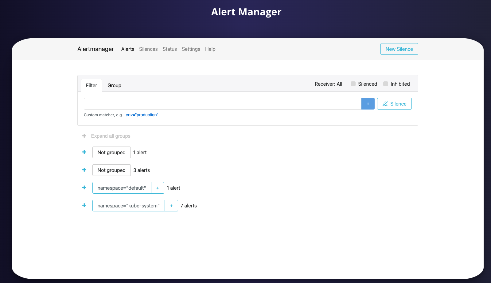

# ClusterWatch

ClusterWatch is an open-source tool which simplifies and provides an all-in-one hub for Kubernetes cluster monitoring.
It reduces the need for DevOps engineers to configure their own Kubernetes monitoring stacks, and automates the process so you can get vital cluster information from various different tools, all in one place, in just a few seconds.

ClusterWatch provides a clear visualization of Kubernetes cluster architecture with detailed descriptions and stats for components within your clusters. ClusterWatch also offers real time metrics data, presented via Grafana charts, and built-in support for Prometheus and alert managing.

## Features

- **Cluster visualization :** The app uses the Vis.js library to create an intuitive cluster visualiation tool, making it easy for users to understand their cluster's _topology_ and access key details about each component without running a single kubectl command.

- **User-friendly interface :** An intuitive and user-friendly interface makes it easy for users to digest relevant cluster data.

- **Prometheus:** Built-in Prometheus integration allows users to execute queries and easily monitor cluster performance without any need for additional configuration.

- **Grafana integration:** Zero-setup Grafana integration provides users access to insightful visualizations of valuable cluster data.

- **Redis:** Fast in-memory caching stores API keys and other sensitive data enabling near instantaneous access times and increased security against session hijacking. This approach ensures only authorized users have access to the cluster data.

- **Alert Manager:** Users can configure alerts directly from ClusterWatch in order to be notified of key cluster events.

- **One-click setup :** You

## Getting Started

1. Clone the repo:
   `git clone https://github.com/oslabs-beta/ClusterWatch.git`

2. Install dependencies:
   `npm install`

3. Ensure that you [install redis](https://redis.io/docs/getting-started/installation/), if you don't already have it installed on your machine.

4. Make sure you have your kubernetes cluster up and running. If you'd like to set up a cluster to test the application, install docker and minikube or kind to get started.

5. Start the application:
   `npm start`

6. Navigate to: `http://localhost:3000`

7. Once launched, you'll be redirected to our setup page:

- If you do not have the prometheus-kube-stack helm chart, (which inlcudes kube-state-metrics, node-exporter, and grafana), utilize the setup button to download, update, and install the repos. Note: this step can take a moment, don't worry.

- If you have grafana, but have not used our application previously, hit the grafana setup button to apply our custom grafana configurations.

- If you have used our application before, press the forward ports button and monitor away!

Keep in mind that the application utilizes local ports which must not be occupied on your machine:

- 3000: server
- 8080: application page
- 3001: grafana
- 9090: prometheus
- 9093: alert manager
- 6379: redis

## Usage Guidelines

### **Overview**

The first page of the application will provide a visual overview of your kubernetes cluster. The visualization will show the control plane, namespaces, pods, services, deployments and nodes. Hovering over the components will display a modal displaying information relevant to that specific object.

### **Metrics**

The metrics section of the application provides grafana dashboards for various aspects of your kubernetes cluster. This includes:

- Kubernetes API server: API server request rates/latency, etcd request cache hit rates/latency, and workqueue latencies.
- Nodes: CPU usage, load average, memory usage, disk I/O, disk usage, network received, network transmitted.
- Kubelet: Operation and error rates, pod start rates and durations, plus more.
- USE methods: Utilization, saturation, and errors for the cluster and nodes.
- CoreDNS: requests, responses, and cache sizes/hits for DNS server.

  
  

### **Prometheus Query**

Here you can access the Prometheus console from within the app to run customized [queries](https://prometheus.io/docs/prometheus/latest/querying/basics/) and create graphs based on the data.

### **Alert Manager**

Here you can view all the active alerts that are set up for your cluster.

### **Custom Alerts**

Configure your own alerts without having to create YAML files.

## Open Source

This product is open source, being actively maintained, and open to contributions. Please inform us of any features or bugs you'd like to see addressed.

#### Testing:

This application utilizes, jest, supertest, react testing library, and cypress for testing.

To run unit and integration tests, execute the following command in your terminal: `npm run test`

To run end-to-end tests, execute: `npm run cypress`

**Contributing:** If you'd like to contribute to this project:

1. Clone repo and create a new branch: `git checkout https://github.com/ -b name_for_new_branch`
2. Make changes and test
3. Submit a pull request with clear descriptions of changes

**Roadmap:**
✅ = Ready to use
⏳ = In progress
🙏🏻 = Looking for contributors
|Feature|Status|
| --- | --- |
|Add Prometheus integration | ✅ |
|Add Grafana Integration| ✅ |
|Add Cluster visualizer | ✅ |
|Add alerts customization | ✅ |
|Add Jest testing | ✅ |
|Add End-to-End cypress testing | ✅ |
|Transform codebase into typescript| ✅ |
|Convert HTTP fetch requests to GraphQL requests | ⏳ |
|Replace Prometheus with VictoriaMetrics| 🙏🏻 |
|Add Authorization | 🙏🏻 |
|Add persiting metrics logs| 🙏🏻 |

## Contributors

<table>

  <tr>
    <td align="center">
      
       
      <b>Sheng li</b>
       
      <a href="https://www.linkedin.com/in/sheng-li-3537783a/"> </img>
      </a>
      
    </td>
    <td align="center">
      
       
      <b>Mushrath Choudhury</b>
       
      
      
    </td>
    <td align="center">
      
       
      <b>Kevin Hendrix</b>
       
      
      
    </td>
     <td align="center">
      
       
      <b>Jordy Gonzalez
       
      
      
    </td>
  </tr>
</table>

## Publications

Check out our medium article: https://medium.com/@shengli356/clusterwatch-official-launch-8c77885de58b
